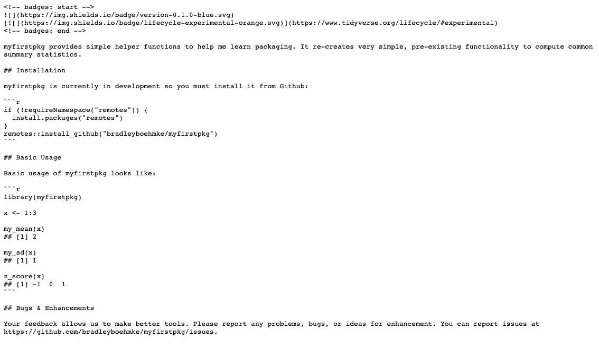
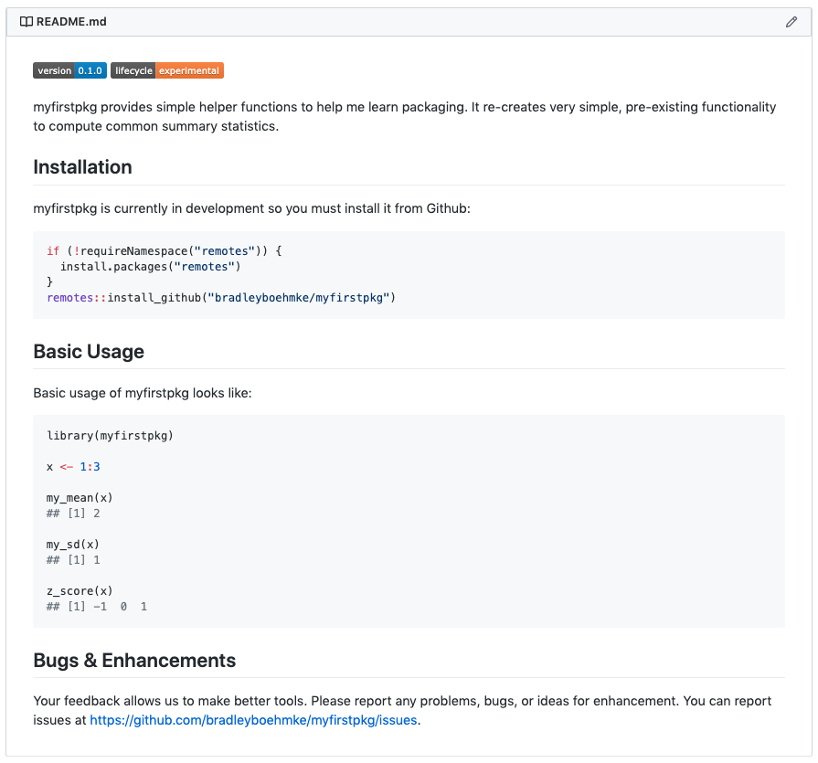
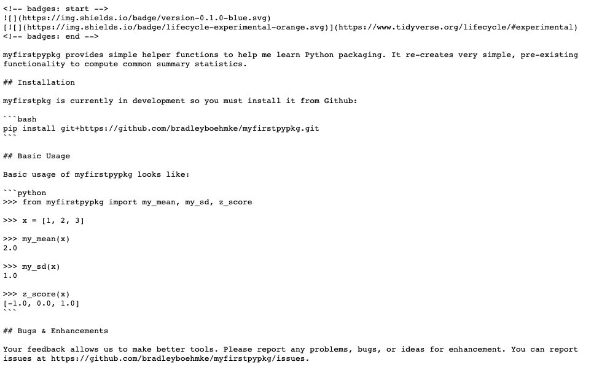
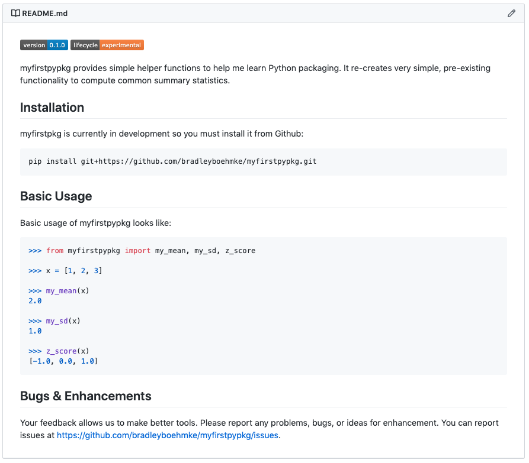

# README {#readme}

A [README](https://en.wikipedia.org/wiki/README) is a text file (often `.md` or `.rst`) that introduces and explains a project. The README is often the first document a user or develop will encounter when first learning about your package. Consequently, it needs to contain information that will allow them to: 

- understand what your package is about, 
- how to install it,
- how to start using it,
- how to communicate with the developers/maintainers.

There are other useful items that you can include to increase user/developer trust (i.e. badges) or improve the learning curve to get started or get questions answered.

The README should always be in the top level directory of the package directory. This is where someone who is new to your package will start out and code hosting services such as GitHub will automatically look for your README and render it as HTML.

```{block, type = "tip"}
The template you used to create your first package alread includes a README ; however, in R you can use `usethis::use_readme_md()` to automatically create a `README.md` file if ones does not already exist. 
```

## Structure

A simple way to structure your README is as follows:

1. A paragraph that describes the high-level purpose of the package.
2. Installation instructions, giving code that can be copied and pasted into an end-user's editor.
3. An example that shows how to use the package to solve a simple problem along with where the user can find more detailed examples if they exist.
4. How a user can report problems, bugs, or ideas for enhancements.
5. Where to find details about contributing to the package (optional).

## Badges

When looking through open source projects it is very common to see badges at the top of the README such as:

- 
- 
- 
- 

Badges like these are not required but often add a level of confidence and professionalism to a package. If you do add badges to your README the ones that are most informative include:

- [Version number](https://shields.io/category/version) signaling the current version available.
- [Lifecycle](https://www.tidyverse.org/lifecycle/) of your package to convey the maturity of your package.
- [Build status](https://shields.io/category/build) to show that the current version builds successfully.
- [Code coverage](https://shields.io/category/coverage) to show how much of your source code is tested.

There are many other badges you can include.

```{block, type="tip"}
Here are some places where you can access/reference common badges you can use in your packages:

- https://shields.io/
- https://naereen.github.io/badges/
- https://www.tidyverse.org/lifecycle/
```

## Great examples

A simple README can go a long way. Here are some great resources to learn more about producing great READMEs and also some fantastic examples:

- https://www.makeareadme.com/
- https://github.com/matiassingers/awesome-readme

## `r fontawesome::fa("r-project")` example

The following is an example of a README you could use for our pet R package:

```{r, echo=FALSE}

```

This results in a README that displays as this in Github:

```{r, echo=FALSE}

```


## `r fontawesome::fa("python")` example

The following is an example of a README you could use for our pet Python package:

```{r, echo=FALSE}

```

This results in a README that displays as this in Github:

```{r, echo=FALSE}

```
