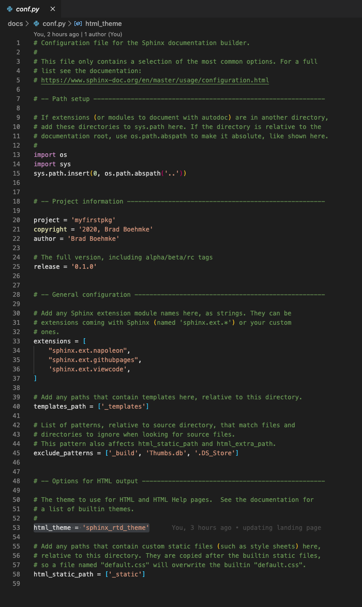
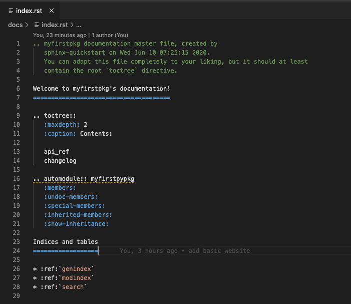
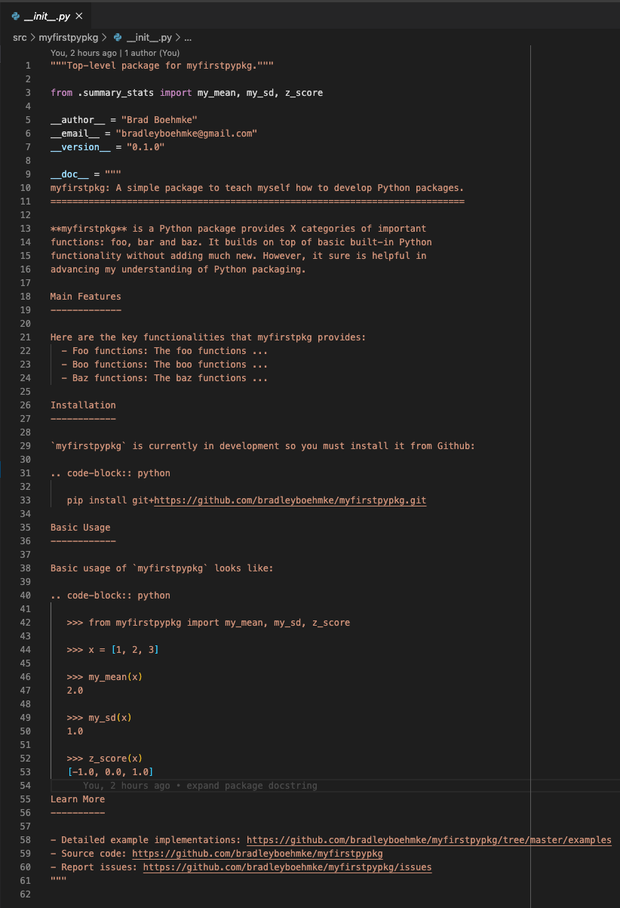
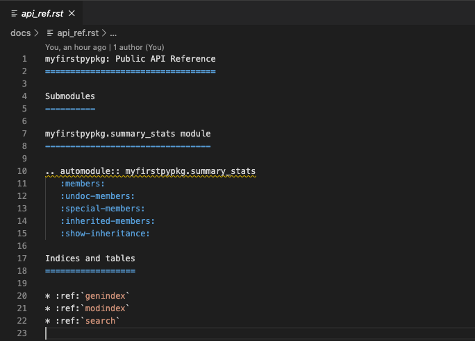
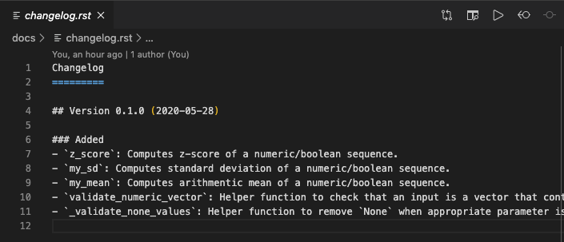

# Package Website {#website}

Although not required, both `r fontawesome::fa("python")` and `r fontawesome::fa("r-project")` have documentation generators that will allow you to set up a website for your package rather easily. These generators include [Sphinx](https://www.sphinx-doc.org/en/master/) for `r fontawesome::fa("python")` packages and [pkgdown](https://pkgdown.r-lib.org/) for `r fontawesome::fa("r-project")` packages.

```{block, type='tip'}
Here are some great examples of websites:

- Python packages
   - [numpy](https://numpydoc.readthedocs.io/en/latest/)
   - [pandas](https://pandas.pydata.org/docs/)
   - [plotnine](https://plotnine.readthedocs.io/en/stable/)
- R packages
   - [bayesplot](http://mc-stan.org/bayesplot/index.html)
   - [vip](https://koalaverse.github.io/vip/index.html)
   - [recipes](https://recipes.tidymodels.org/)
```

In both cases, the website documentation is contained in a `/docs` subdirectory of the package. Github allows you to host HTML files in the `/docs` subdirectory as a static website. To do so, we need to got to __Settings__ within our Github repo:

```{r, echo=FALSE}
knitr::include_graphics("figures/github-repo-settings.png")
```

Scroll down to __GitHub Pages__ and select "master branch /docs folder:

```{r, echo=FALSE}
knitr::include_graphics("figures/github-repo-enable-github-pages.png")
```

This will generate a URL (i.e. https://bradleyboehmke.github.io/myfirstpkg/). Currently this URL will not render anything (actually, it will render a 404 _file not found_ error) since we haven't produced the website docs but once we do create our website files, we can then share this URL so people can view our website. Let's go ahead and create our package websites!

```{block, type = 'warning'}
Realize that these websites can become extremely elaborate and complex. We are only concerned with generating a basic website and you can advance your understanding and implementations as you learn more.
```

## `r fontawesome::fa("r-project")` example

### Creating

To create a website for our `r fontawesome::fa("r-project")` package, first we need to make sure we have the pkgdown package installed.

```{r, eval=FALSE}
# isntall and save to virtual environment file
install.packages("pkgdown")
renv::snapshot()
```

Now it's just two additional calls to create our website:

1. `usethis::use_pkgdown`
   - Creates the `/docs` directory if it does not exist
   - Creates a blank `_pkgdown.yml` file
2. `pkgdown::build_site()`
   - Adds various CSS and JavaScript dependency files to the `docs/` directory
   - Creates various HTML files based on package information (`DESCRIPTION`, `README`, `NEWS`, and available vignettes and function documentation)

```{r, eval=FALSE}
# Run once to configure package to use pkgdown
usethis::use_pkgdown()

# Run to build the website
pkgdown::build_site()
```

`pkgdown::build_site()` should produce a local version of your website so you can preview what it will look like. For our example package it should look like the following where:

- Main landing page will reflect your README,
- The __Get Started__ page will be your vignette,
- The __Reference__ page will show all your functions and their documentation,
- The __Changelog__ page is produced from your NEWS file.

```{r, echo=FALSE}
knitr::include_graphics("figures/pkgdown-website.png")
```

Before we commit and push to Github you'll want to go to the .gitignore file and make sure the `/docs` directory is not being ignored. If it is, then none of our website files will be pushed to Github. You can run the following to open up your .gitignore file:

```{r, eval=FALSE}
usethis::edit_git_ignore(scope = "project")
```

Scroll to the bottom and if you see "docs" listed as the very last entry, delete that line. Now you can commit and push your changes to Github. You will not be able to see your website until you merge these changes to the master branch.

```{block, type='warning'}
Remember to first merge your feature branch to the develop branch and then merge the develop branch to the master if you want to see your website. That way you will make sure all your other changes you've been making will be included in your master branch.
```

The default pkgdown website has pretty nice defaults. However, you have the ability to adjust the website's:

- Metadata
- Home page
- Function reference
- Articles
- News

These components are all overridden by adding components to the `_pkgdown.yml` file, which is initially blank. Learn more about customizing your webiste [here](https://pkgdown.r-lib.org/articles/pkgdown.html).

### Updating

The above procedures are only required when first creating your website. As you make future changes to your package such as:

- Adding new functions or changing function documentation
- Updating the README
- Updating the NEWS file
- Adding or changing vignettes

then you are going to want to run the following to update the website accordingly.

```{r, eval=FALSE}
# Run to update the website
pkgdown::build_site()
```

### Publishing

Once you push the changes to the master branch then you should see your published website at https://<username>.github.io/<packagename>/index.html.  See the published website for my example R package at https://bradleyboehmke.github.io/myfirstpkg/index.html.


## `r fontawesome::fa("python")` example

### Creating

Creating a website for a `r fontawesome::fa("python")` package is not as straight forwards as in `r fontawesome::fa("r-project")`. To build our website we will use [Sphinx](https://www.sphinx-doc.org/en/master/), which is already pre-installed since it is included in the setup.py file as a developer requirement package.

To create our website we need to change our working directory to the `docs/` directory and then we can run `sphinx-quickstart` to create the initial website framework. 

```{block, type='tip'}
When running `sphinx_quickstart` you will be asked a series of questions. Make sure to specify `n` when asked about having separate source and build directories. Otherwise supply the information relevant to your project. Here is what I entered:

1. `Separate source and build directories (y/n) [n]: n`
2. `Project name: myfirstpkg`
3. `Author name(s): Brad Boehmke`
4. `Project release []: 0.1.0`
```

```bash
cd docs
sphinx-quickstart
```

Next, we'll create a `.nojekyll` file since many of the subdirectories created by Sphinx start with `_` and Github does not no how to handle these very well.

```bash
touch .nojekyll
```

When we create our website, the actual HTML pages produced will be located in the `docs/_build/html/` directory.  However, we setup Github to look for a landing page (i.e. `index.html` file) in the `docs/` directory. To help Github find the `docs/_build/html/index.html` file we can create a redirection file.  To do the following:

```bash
# create index file in docs/ directory
touch index.html

# makes Github redirect the location of the landing page
echo '<meta http-equiv="refresh" content="0; url=./_build/html/index.html" />' >> index.html
```

One of the files created by `sphinx-quickstart` is `conf.py`, which specifies your Sphinx configuration. You'll have to make a series of edits to this file:

- Uncomment the three lines under the "-- Path Setup" section. This will ensure that Sphinx can see your Python code. 
- Change the single dot in `os.path.abspath('.')` to two dots, so that the third line reads `sys.path.insert(0, os.path.abspath('..'))`.
- Add the following to the extensions list:
  - `'sphinx.ext.napoleon'`
  - `'sphinx.ext.githubpages'`
  - `'sphinx.ext.viewcode'`

We can also change the theme of our website, for example the [Read the Docs theme](https://sphinx-rtd-theme.readthedocs.io/en/stable/) is very popular. We can use this theme by change the `html_theme` to `html_theme = 'sphinx_rtd_theme'`.

After making these changes your `conf.py` file should look like:

```{r, echo=FALSE}

```

Now we are ready to make a basic website. To create our website we run `make HTML` within the `docs/` directory. However, this basic website will not have much useful information. So, we need to make some adjustments so that our package information is created for the website.

The main entry point for documentation is the `docs/index.rst` file. Go ahead and open that file and add the necessary information so it look like:

```{block, type='tip'}
Sphinx uses an alternative to Markdown called reStructuredText (`.rst`). The syntax is very similar to Markdown but also has some unique differences. If you are unfamiliar with reStructuredText here is a handy primer: https://www.sphinx-doc.org/en/master/usage/restructuredtext/basics.html
```

```{r, echo=FALSE}

```

The main things to note here are:

```python
.. toctree::
   :maxdepth: 2
   :caption: Contents:

   api_ref                      # this will reference a file we'll add shortly
   changelog                    # this will reference a file we'll add shortly

.. automodule:: myfirstpypkg    # this makes the first part of our website use the
   :members:                    # package docstring that we added in __init__.py
   :undoc-members:
   :special-members:
   :inherited-members:
   :show-inheritance:
```

Since we are going to use the package docstring as our website's landing page information, we can update our package docstring to look like the following. This isn't necessary but will add installation and usage examples to our website automatically:

```{r, echo=FALSE}

```

Next, we'll add an `api_ref.rst` file that will provide docstring information for all the submodule and functions in our package. 

```bash
# create the file
touch api_ref.rst
```

Add the following information to the `api_ref.rst` file. This will autogenerate docstring information for the `myfirstpypkg.summary_stats` module.

```{r, echo=FALSE}

```

Last, let's create a `changelog.rst` file that will provide our website with release update information. We can simply copy the `CHANGELOG.md` file from our package's root directory but we need to change the header line to proper `.rst` syntax.

```bash
# copy changelog 
cp ../CHANGELOG.md changelog.rst
```

Your `changelog.rst` should look like this:

```{r, echo=FALSE}

```

Finally, we can now create our website!  All you need to do is run the following:

```bash
make html
```

```{block, type='warning'}
Remember to first merge your feature branch to the develop branch and then merge the develop branch to the master if you want to see your website. That way you will make sure all your other changes you've been making will be included in your master branch.
```

Sphinx documentation is extremely flexible and customizable. Learn more about customizing your website [here](https://www.sphinx-doc.org/en/master/usage/quickstart.html).

### Updating

The above procedures are only required when first creating your website. As you make future changes to your package such as:

- Adding new classes, methods or functions or changing docstrings
- Updating the package docstring
- Updating the CHANGELOG file
- or adding any additional files

then you are going to want to make the necessary changes to the files in the `docs/` directory and re-build the webiste with:

```bash
# Run to update the website
make html
```

### Publishing

Once you push the changes to the master branch then you should see your published website at https://<username>.github.io/<packagename>/index.html.  See the published website for my example Python package at https://bradleyboehmke.github.io/myfirstpypkg/index.html.
