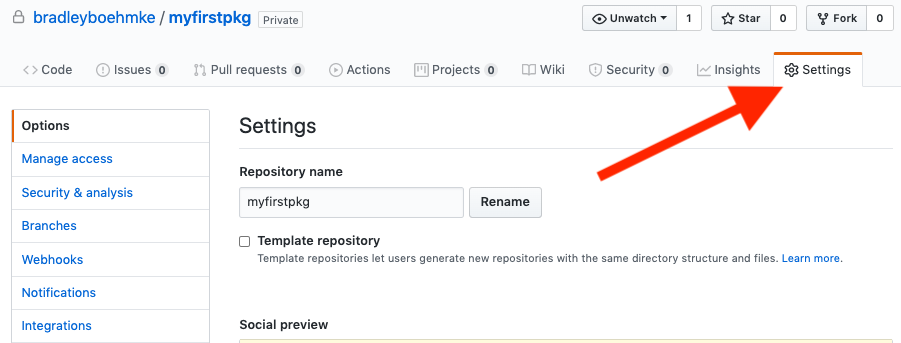
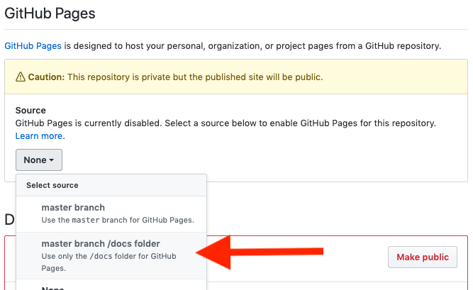
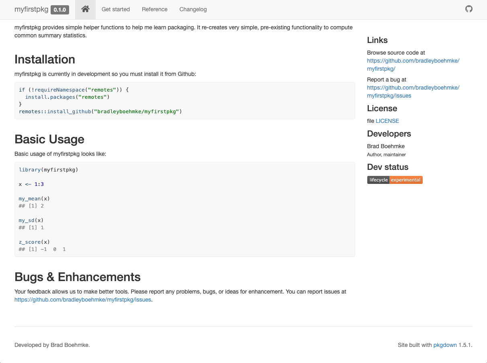

# Package Website {#website}

Although not required, both `r fontawesome::fa("python")` and `r fontawesome::fa("r-project")` have documentation generators that will allow you to set up a website for your package rather easily. These generators include [Sphinx](https://www.sphinx-doc.org/en/master/) for `r fontawesome::fa("python")` packages and [pkgdown](https://pkgdown.r-lib.org/) for `r fontawesome::fa("r-project")` packages.

```{block, type='tip'}
Here are some great examples of websites:

- Python packages
   - [numpy](https://numpydoc.readthedocs.io/en/latest/)
   - [pandas](https://pandas.pydata.org/docs/)
   - [plotnine](https://plotnine.readthedocs.io/en/stable/)
- R packages
   - [bayesplot](http://mc-stan.org/bayesplot/index.html)
   - [vip](https://koalaverse.github.io/vip/index.html)
   - [recipes](https://recipes.tidymodels.org/)
```

In both cases, the website documentation is contained in a `/docs` subdirectory of the package. Github allows you to host HTML files in the `/docs` subdirectory as a static website. To do so, we need to got to __Settings__ within our Github repo:

```{r, echo=FALSE}

```

Scroll down to __GitHub Pages__ and select "master branch /docs folder:

```{r, echo=FALSE}

```

This will generate a URL (i.e. https://bradleyboehmke.github.io/myfirstpkg/). Currently this URL will not render anything (actually, it will render a 404 _file not found_ error) since we haven't produced the website docs but once we do create our website files, we can then share this URL so people can view our website. Let's go ahead and create our package websites!

```{block, type = 'warning'}
Realize that these websites can become extremely elaborate and complex. We are only concerned with generating a basic website and you can advance your understanding and implementations as you learn more.
```

## `r fontawesome::fa("r-project")` example

To create a website for our `r fontawesome::fa("r-project")` package, first we need to make sure we have the pkgdown package installed.

```{r, eval=FALSE}
# isntall and save to virtual environment file
install.packages("pkgdown")
renv::snapshot()
```

Now it's just two additional calls to create our website:

1. `usethis::use_pkgdown`
   - Creates the `/docs` directory if it does not exist
   - Creates a blank `_pkgdown.yml` file
2. `pkgdown::build_site()`
   - Adds various CSS and JavaScript dependency files to the `docs/` directory
   - Creates various HTML files based on package information (`DESCRIPTION`, `README`, `NEWS`, and available vignettes and function documentation)

```{r, eval=FALSE}
# Run once to configure package to use pkgdown
usethis::use_pkgdown()

# Run to build the website
pkgdown::build_site()
```

`pkgdown::build_site()` should produce a local version of your website so you can preview what it will look like. For our example package it should look like:

```{r, echo=FALSE}

```

Before we commit and push to Github you'll want to go to the .gitignore file and make sure the `/docs` directory is not being ignored. If it is, then none of our website files will be pushed to Github. You can run the following to open up your .gitignore file:

```{r, eval=FALSE}
usethis::edit_git_ignore(scope = "project")
```

Scroll to the bottom and if you see "docs" listed as the very last entry, delete that line. Now you can commit and push your changes to Github. You will not be able to see your website until you merge these changes to the master branch.

```{block, type='warning'}
Remember to first merge your feature branch to the develop branch and then merge the develop branch to the master if you want to see your website. That way you will make sure all your other changes you've been making will be included in your master branch.
```

The default pkgdown website has pretty nice defaults. However, you have the ability to adjust the website's:

- Metadata
- Home page
- Function reference
- Articles
- News

These components are all overridden by adding components to the `_pkgdown.yml` file, which is initially blank. Learn more about customizing your webiste [here](https://pkgdown.r-lib.org/articles/pkgdown.html).

## `r fontawesome::fa("python")` example
