<br>

As data scientists, we get used to common workflows that exist in exploring and modeling data. However, the package development workflow is often unique from how we are used to working. This chapter is designed to get you started on a small package so you can experience the typical workflow. First, we'll discuss the common steps and then we will work through them for both an `r fontawesome::fa("r-project")` and `r fontawesome::fa("python")` version of the package.

# Create the package

Once you have determined the need to create a package, the first thing we need to do is identify a package name, create the basic package structure, and connect it to a version control system (i.e. Github) of interest.

## Name the package

Naming our package is important. There are certain requirements we need to adhere to but, also, the name you choose should be easy to remember and follow the respective languages idiomatic approach to naming. Moreover, the name you choose should not already exist.

`r fontawesome::fa("r-project")` and `r fontawesome::fa("python")` have slightly different requirements regarding acceptable names. In both languages, you can only use letters and numbers; however, you can't start the name with a number. In `r fontawesome::fa("r-project")` your name can contain a `.` but not a `-` or `_` while in `r fontawesome::fa("python")` your name can contain all three. In both languages you can combine upper and lowercase letters in the name.

However, our advice is to keep the name short, all lowercase, and with no separator when possible. Examples of good approaches to name include:

- numpy
- dplyr
- pandas
- keras

Once you've come up with a name or two you probably want to make sure that the name is not already being used. The package managers (CRAN & PyPI) do not allow duplicate names so your name must be unique. Even if you don't intend to share your package publicly, you should avoid duplicate names if possible. Both `r fontawesome::fa("r-project")` and `r fontawesome::fa("python")` have tools that make this easy to do and we'll cover them in the hands-on sections of this chapter.

## Create the package structure 

Once you have a name its time to create the package. This includes determining where the package will live on your operating system and creating the bare bones framework of the package. 

When creating a package, the source code location (path) refers to where the __source__ lives, not where the __installed__ form lives. Recall in Chapter \@ref(intro) that installed packages all live within a library directory. But when developing, you will keep the source code somewhere else. 

Where should you keep source packages? The main principle is that this location should be distinct from where installed packages live. In the absence of external considerations, a typical user should designate a directory inside their home directory for `r fontawesome::fa("r-project")` and `r fontawesome::fa("python")` (source) packages. This may be in directories such as `~/Desktop/Packages/` or `/r/packages` and `/python/packages`. Some of us use one directory for this, others divide source packages among a few directories. This probably reflects that we are primarily tool-builders. An academic researcher might organize their files around individual publications, whereas a data scientist might organize around data products and reports. There is no particular technical or traditional reason for one specific approach. As long as you keep a clear distinction between source and installed packages, just pick a strategy that works within your overall system for file organization, and use it consistently.

Once you have a location to hold the source code, both `r fontawesome::fa("r-project")` and `r fontawesome::fa("python")` have tools that help to automate the creation of a basic package structure. We'll use these tools in the hands-on sections of this chapter.

## Enable version control {#version-control}

Most package development never resides solely on one operating system nor with only one developer. So not only should we be using git for version control, we should be using a hosting platform such as [GitHub](https://github.com/), [GitLab](https://gitlab.com/), [Azure Repos](https://azure.microsoft.com/en-us/services/devops/repos/), or the like. So the first thing we need to do is connect our local git repository to a remote repository so we can push, pull, and merge updates we make to the package.

Once we have established our remote repository, we should set up a proper branching method for our work. We advise a Git flow branching strategy where:

- __master__ branch is the "production" release branch. This is the main branch where the source code always reflects a production-ready state. 
- __develop__ branch is the main branch where the source code always reflects a state with the latest delivered development changes for the next release. Some would call this the “integration branch”.
- __supporting branches__ are the branches where we do the majority of our work. These are the branches where we create new fixtures, fix bugs, improve documentation.

In this branching approach, we will make updates to our package in a supporting branch, then do a pull request to merge these updates into the develop branch. Once the develop branch has enough updates to warrant a new release we then merge the develop to master with a pull request.

```{block, type='note'}
This may seem like a lot to digest and it may seem like overkill when working on our own small prototype packages. However, this is how larger projects should be organized so adopting this approach now will make it easier when you start working on larger, group projects/packages. If you are unfamiliar with git and branching then we recommend these tutorials to get started:

- [Understanding the GitHub flow](https://guides.github.com/introduction/flow/)
- [A successful Git branching model](https://nvie.com/posts/a-successful-git-branching-model/)
```

In the hands-on sections of this chapter we'll walk through setting up this git flow branching strategy.

## Setup a virtual environment

By default, every project on your system will use the same library directory to store and retrieve packages. At first glance, this may not seem like a big deal but it does matter when different projects require different versions of dependency packages.

Consider the following scenario where you have two projects: __Project A__ and __Project B__, both of which have a dependency on the same library, __somepkg__. The problem becomes apparent when we start requiring different versions of __somepkg__. Maybe __Project A__ needs v1.0.0, while __Project B__ requires the newer v2.0.0, for example.

This is a real problem for both `r fontawesome::fa("r-project")` and `r fontawesome::fa("python")` since they can’t differentiate between versions in the library directory. So both v1.0.0 and v2.0.0 would reside in the same directory with the same name. Since packages are stored according to just their name, there is no differentiation between versions. Thus, both __Project A__ and __Project B__ would be required to use the same version, which is unacceptable in many cases.

This is where virtual environments come into play. Virtual environments create an isolated environment for our project. This means that each project can have its own dependencies, regardless of what dependencies every other project has. This creates better reliability during the development process.

In the hands-on sections of this chapter, we'll setup `r fontawesome::fa("r-project")` and `r fontawesome::fa("python")` virtual environments. We consider it a best practice to always do your development work in virtual environments.

```{block, type='tip'}
To learn more about virtual environments we suggest starting with the following tutorials:

- [Python Virtual Environments: A Primer](https://realpython.com/python-virtual-environments-a-primer/)
- [renv: Project Environments for R](https://rstudio.github.io/renv/articles/renv.html)
```

## Add new functionality

So we finally have our project set-up ready, now it's time to start adding some functionality. When adding new functionality or fixing a bug, it's important to approach it strategically. Rather than just adding or changing code, we should do it in a way that we know whether our code is successful or not. To accomplish this, we should use a [test-driven development](https://en.wikipedia.org/wiki/Test-driven_development) (TDD) approach.

The general idea behind TDD is to follow this basic approach:

1. __Add a test__: In TDD, each new feature or bug fix begins with writing a test. This test defines a function, improvements of a function, or a case in which a function results in a bug.
2. __Run test(s) and make sure the new test fails__: Before writing any source code, run the new test to ensure that it fails.
3. __Write the code__: The next step is to write some code that causes the test to pass. The new code written at this stage is not perfect and may, for example, pass the test in an inelegant way. That is acceptable because it will be improved and honed in Step 5.
4. __Run tests__: If all test cases now pass, the programmer can be confident that the new code meets the test requirements, and does not break or degrade any existing features. If they do not, the new code must be adjusted until they do.
5. __Refactor code__: Once the source code passes the test, you should spend time refactoring and cleaning it up. A growing code base can quickly get out of control. This step ensures you take the time to reduce [tech debt](https://en.wikipedia.org/wiki/Technical_debt).
6. __Repeat__: Starting with another new test, the cycle is then repeated to push forward the functionality of the source code.

This may seem like a lot of steps to remember but this process is rather quick and each step takes very small incremental steps forward. After implementing a few features in this manner it quickly becomes a natural approach to software development.

```{block, type='tip'}
If you are interested in learning more about the TDD philosophy we recommend the following books:

- [The Pragramatic Programmer](https://www.amazon.com/Pragmatic-Programmer-journey-mastery-Anniversary/dp/0135957052/ref=dp_ob_title_bk) (Ch. 41)
- [Clean Code](https://www.amazon.com/Clean-Code-Handbook-Software-Craftsmanship/dp/0132350882/ref=pd_bxgy_img_2/134-3713013-8748161?_encoding=UTF8&pd_rd_i=0132350882&pd_rd_r=c66a8eb8-13a3-4246-bf5c-47bff29f3be6&pd_rd_w=m2kCB&pd_rd_wg=NqeJv&pf_rd_p=4e3f7fc3-00c8-46a6-a4db-8457e6319578&pf_rd_r=R46745MCZ1C0V1ZD3QS4&psc=1&refRID=R46745MCZ1C0V1ZD3QS4) (Ch. 9)
- [Test Driven Development](https://www.amazon.com/Test-Driven-Development-Kent-Beck/dp/0321146530)
```

# Document

Once your new functionality is successfully passing tests and has been refactored, you should make sure any necessary documentation is added or updated. This will include function specific documentation, module level documentation, any code in example notebooks or vignettes and the like.

# Version control

Lastly, we need to now save our work to our remote repository. This typically includes staging, commiting and pushing our changes. Depending on the stage of our work we may be ready to do a pull request into the main development branch.

Okay, so this may seem like a lot of steps to keep track of. Often, this feels more convoluted on paper than when you are actually implementing so let's start working with an example package to go through these steps.

# `r fontawesome::fa("r-project")` workflow example {#workflow-r}

Let's work through a simple example to illustrate how to perform the previous steps discussed for an `r fontawesome::fa("r-project")` package. We'll create a package that has a single function. To simplify this process we'll just reimplement existing functionality that already exists in R...calculating the mean of a vector.

## Step 1: Check package name

Although we are not going to publish this package we should still check to make sure there are no other packages that have the same name. For this example, I'm going to use the name "__myfirstpkg__". We can use `available::available()` to check the availability of the name on CRAN, Bioconductor (another R package manager that is focused on biostats packages), and Github. It will even provide you hyperlinks to common websites that will let you know if this name is an existing abbreviation, wikipedia topic, or even in an urban dictionary along with any unexpected sentiment.

In this case, we see that there are no conflicting packages on CRAN or Bioconductor but there are on Github. This is ok in this case as I don't expect to import and use other peoples first packages!  So let's proceed.

```{r check-r-name}
available::available("myfirstpkg", browse = FALSE)
```

## Step 2: Create package directory and structure

Now let's create the initial package structure. There are several ways to do this but in this case I've set up a pre-built template that helps automate the initial structure. Open up your terminal and run:

```bash
pip install cookiecutter
```

Now go to the location that you want the package source code to live (i.e. a directory on your Desktop versus in a Packages subdirectory). In my case, I am going to keep this in a misk subdirectory:

```bash
cd ~/Desktop/Workspace/Projects/misk
```

Next, we'll run the following command. This uses [cookiecutter](https://cookiecutter.readthedocs.io/en/1.7.2/README.html) to create our simplified pre-built package. 

```bash
cookiecutter https://github.com/misk-data-science/package-template
```

When you run this, you will be asked a series of questions such as your name, email, and package specific questions. For my package, I provided the following command responses:

```bash
first_name [ex: John]: Brad
last_name [ex: Smith]: Boehmke
email [first.last@example.com]: bradleyboehmke@gmail.com
github_username [bradleyboehmke]: bradleyboehmke
package_language [r or python]: r
package_name [awesome]: myfirstpkg
package_short_description [short one-liner, ex: My first package]: My first package
version [0.1.0]: 
url [https://github.com/bradleyboehmke/myfirstpkg]: 
Select open_source_license:
1 - MIT license
2 - BSD license
3 - ISC license
4 - Apache Software License 2.0
5 - GNU General Public License v3
6 - Not open source
Choose from 1, 2, 3, 4, 5, 6 [1]: 5
```

```{block, type='warning'}
The values in the brackets are the default values if you do not supply any input. For example, note how I did not enter any values for the version number or the URL. This is because 0.1.0 is nearly always a good first version number to start with. The Github URL is automatically generated so unless you choose to use a different remote the default should be a good choice.
```

You should now have a directory with your package name in your current directory. If you use the shell command `ls` you should see __myfirstpkg__ listed. Here is what my directory look likes:

```bash
ls
ds-packages		misk-dl			misk-homl		myfirstpkg		package-template
```

## Step 3: Version control

The first thing we want to do is create a remote where we'll push our source code to (i.e. Github). In our case, we'll use Github. First, [create a new repository](https://help.github.com/en/articles/creating-a-new-repository) on GitHub. 

```{r create-repo, echo=FALSE, fig.align='center'}
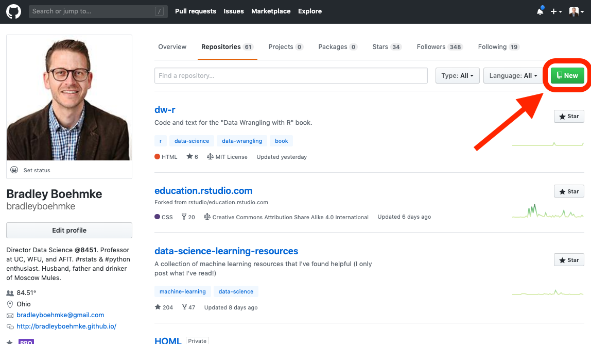
```

To avoid errors, do not initialize the new repository with README, license, or gitignore files since our local directory already contains these files.

```{r create-repo2, echo=FALSE, fig.align='center'}
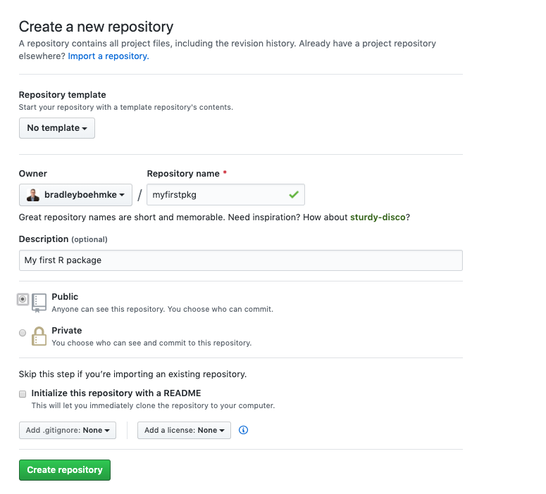
```

Now go back to your terminal and `cd` into the source code directory.

```bash
cd myfirstpkg
```

Next, we initialize the local package directory as a git repo and add the remote URL. This allows changes to be tracked and when we push and pull our changes it will push and pull from the URL location.  We can always verify that our remote was added with `git remote -v`:

```bash
git init .
git remote add origin https://github.com/bradleyboehmke/myfirstpkg

# verify remotes were added
git remote -v
origin	https://github.com/bradleyboehmke/myfirstpkg (fetch)
origin	https://github.com/bradleyboehmke/myfirstpkg (push)
```

Now let's create our first commit so that we have a baseline (although empty) package.

```bash
git add -A
git commit -m "create initial package structure"
git push --set-upstream origin master
```

Now if you look at your Github repo you will see the master branch has your current directory contents.

```{r initial-master, echo=FALSE, fig.align='center'}
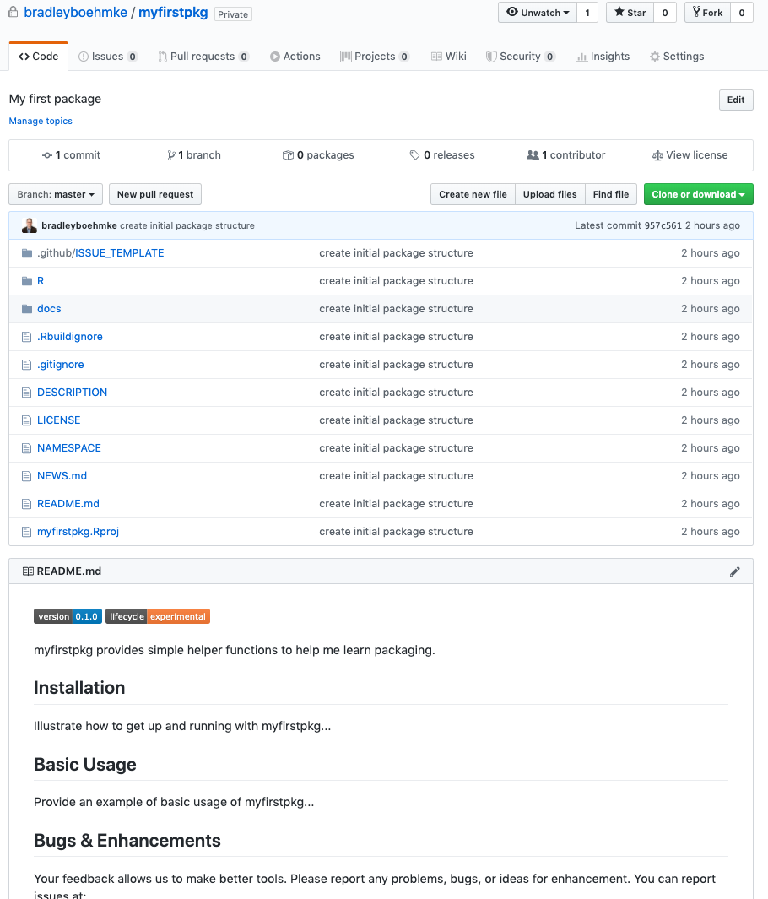
```

Recall in section \@ref(version-control) that we prefer to do development work with a __support » develop » master__ branch framework. This has us doing work in a support branch and not the master or develop branch. Right now we only have a master branch established so let's create a develop branch with `git checkout -b develop` and push the contents of the develop branch (which are the same as the master) to Github.

```bash
git checkout -b develop
git push --set-upstream origin develop
```

Now if you look at Github you'll notice that we have two branches in our repo:

```{r two-branches, echo=FALSE, fig.align='center'}
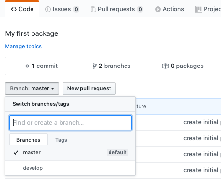
```

Whew `r emo::ji("whew")`! We finally have our version control set up. That was a bit of work but you only need to do that once at package creation time.

## Step 4: Setup virtual environment

Before we add any new functionality to our package, let's create a virtual environment so we can keep all our package dependencies isolated to the location we are working in. Go ahead and open up the R project in the package source code location. You can do that by clicking on the `myfirstpkg.Rproj` file or from the command line with:

```bash
open myfirstpkg.Rproj
```

This will open the package project within RStudio, which is where we'll do the majority of our work from here on out. We'll use the __renv__ package to create a virtual environment. Using `bare = TRUE` will create an empty projec library (with the exception of __renv__.

```{block, type='tip'}
Running `renv::init()` uses the default `bare = FALSE` which will perform an automate search throughout your directory to identify required packages and automatically install them into your environment.
```

```{r, eval=FALSE}
# install.packages("renv") # install renv if necessary
renv::init(bare = TRUE)
```

This will add some hidden files and a `renv/` directory to your repo. If you look inside the `renv/` directory you will see that only one package exists, the __renv__ package.  The first thing we want to do is make sure we have the __devtools__ package installed. This is the primary dev package required for package development. Running the following will install devtools into our virtual environment.

```{block, type="tip"}
If you previously installed a package that meets the version number requested, __renv__ is smart and does a linked cache rather than install the package completely. This means if you use the latest version of __devtools__ in many projects you won't be needlessly installing and storing multiples of the same version.
```

```{r, eval=FALSE}
install.packages("devtools")
```


Now let's install all the initial packages that we will need. The `DESCRIPTION` file always contains a packages dependencies. By running the following, we will install all these dependencies into our environment.

```{r, eval=FALSE}
devtools::install_deps()
```

The last thing we need to do is run `renv::snapshot()`. This saves the state of our project dependencies to a `renv.lock` file. That is, `renv.lock` holds all installed dependency packages required by your project. That way, anyone can recreate your virtual environment by running `renv::restore()`.

```{r, eval=FALSE}
renv::snapshot()
```

```{block, type="tip"}
Anytime you add a new dependency package make sure you run `renv::snapshot()` to update the `renv.lock` project dependency list.
```

## Step 5: Add new functionality

Now that our virtual environment is set up, let's add some functionality to our package.  The first thing we'll add is a function that computes the mean of a vector. Recall that when we add new functionality we:

1. create a new branch to do the work in,
2. create a test that initially fails,
3. write the code to make the test pass.

So first, we'll create a new branch, which we can just call `add_mean`:

```bash
git checkout -b add_mean
```

Now let's create two new files:

- `usethis::use_r("mean")`: creates a new `mean.R` file within the `R/` directory. This is where our function will be written.
- `usethis::use_test("mean")`: creates a new `test-mean.R` file within the `tests/testthat/` directory. This is where the test ensure our function is working correctly will go.

```{r, eval=FALSE}
usethis::use_r("mean")
usethis::use_test("mean")
```

```{block, type="note"}
Later chapters will discuss ways to organize your source code within the `R/` directory and your associated tests. For now, we'll just create a new script for both.
```

Now open up the `R/mean.R` file and insert a shell function. Since this function is empty it simply returns `NULL` but it will allow us to create and run a failing first test.

```{r, eval=FALSE}
my_mean <- function(x) {
  
}
```

Now open the `tests/testthat/test-mean.R` file and let's create our first test. We can always add more tests later but for the first test we just want to check for the most basic functionality. Consequently, this test is simply testing that the mean of vector containing values 0, 1, 2, 3, 4, 5, 6, 7, 8, 9, 10 is 5.

```{r, eval=FALSE}
test_that("mean of simple vectors compute accurately", {
  x <- 0:10

  expect_equal(my_mean(x), 5)
})
```

To run our test, we need to first load our package's function (just `my_mean` for now) and then execute the test. You can do this from the RStudio console with:

```{r, eval=FALSE}
devtools::load_all()
devtools::test()
## ✓ |  OK F W S | Context
## x |   0 1     | mean
## ─────────────────────────────────────────────────────────────────────────────────────
## test-mean.R:4: failure: mean of simple vectors compute accurately
## my_mean(x) not equal to 5.
## target is NULL, current is numeric
## ─────────────────────────────────────────────────────────────────────────────────────
## 
## ══ Results ══════════════════════════════════════════════════════════════════════════
## OK:       0
## Failed:   1
## Warnings: 0
## Skipped:  0
```

```{block, type="tip"}
You will find yourself doing this pattern often. The shortcut for `devtools::load_all()` is Ctrl + Shift + L (Windows & Linux) or Cmd + Shift + L (macOS) and `devtools::test()` is Ctrl/Cmd + Shift + T.
```

As you see above, our test is failing. So let's start adding code to make this test pass. We know that the mean is computed as $m = \frac{\text{sum of terms}}{\text{number of terms}}$. Let's update our function to account for that:

```{r, eval=FALSE}
my_mean <- function(x) {
  total <- sum(x)
  units <- length(x)
  return(total / units)
}
```

Now running our test again we get success!

```{r, eval=FALSE}
devtools::test()
## ✓ |  OK F W S | Context
## ✓ |   1       | mean
## 
## ══ Results ══════════════════════════════════════════════════════════════════════════
## OK:       1
## Failed:   0
## Warnings: 0
## Skipped:  0
```

We likely want to iterate like this to make our function more robust. For example, what happens if a user passes non-numeric values or a non-vector data structure to our function?  Or what happens if our vector contains `NA`, `NaN`, or `Inf` values? For each scenario like this we want to create a test first, make sure it fails, and then add the new functionality to our code to make our tests pass.  We'll explore this process more in chapter \@ref(test).

We have empirical evidence that `my_mean()` works. But how can we be sure that all the moving parts of our package still work? This may seem silly to check, after such a small addition, but it’s good to establish the habit of checking this often. `R CMD check`, executed in the shell, is the gold standard for checking that an R package is in full working order. `devtools::check()` is a convenient way to run this without leaving your R session.

```{block, type="tip"}
A shortcut for `devtools::check()` is Ctrl/Cmd + Shift + E

Also, note that this check produces rather voluminous output. The last output will list the key results and, if there are errors or warnings, it will typically point you in the right direction to resolve them.
```

```{r, eval=FALSE}
devtools::check()
## ── Building ────────────────────────────────────────────────────────────────── myfirstpkg ──
## Setting env vars:
## ● CFLAGS    : -Wall -pedantic -fdiagnostics-color=always
## ● CXXFLAGS  : -Wall -pedantic -fdiagnostics-color=always
## ● CXX11FLAGS: -Wall -pedantic -fdiagnostics-color=always
## ────────────────────────────────────────────────────────────────────────────────────────────
## ✓  checking for file ‘/Users/b294776/Desktop/Workspace/Projects/misk/myfirstpkg/DESCRIPTION’ ...
## ...
## ...
## ── R CMD check results ─────────────────────────────────────────────── myfirstpkg 0.1.0 ────
## Duration: 11.4s
## 
## 0 errors ✓ | 0 warnings ✓ | 0 notes ✓
```

## Step 6: Document

We now have new working functionality in our package, the last thing we want to do is properly document our function. We do this with [__roxygen2__](https://roxygen2.r-lib.org/), which was installed in our environment when we ran `devtools::install_deps()`. We can add object-level documentation to our `my_mean()` function like this:

```{r, eval=FALSE}
#' Mean of a vector
#'
#' @description 
#' Computes arithmetic mean of a vector with numeric or logical values.
#'
#' @param x A numeric or logical vector.
#'
#' @return 
#' The arithmetic mean of the values in x returned as a numeric vector of length one.
#'
#' @examples
#' x <- 1:10
#' my_mean(x)
#'
#' @export
my_mean <- function(x) {
  total <- sum(x)
  units <- length(x)
  return(total / units)
}
```

After adding the documentation we can run `devtools::document()` or (Cmd/Ctrl + Shift + D):

```{r, eval=FALSE}
devtools::document()
## Updating myfirstpkg documentation
## Loading myfirstpkg
## Writing my_mean.Rd
## Writing NAMESPACE
## Documentation completed
```

Now you can run `?my_mean` and you'll see the help documentation show up in the RStudio window:

```{r help-docs, echo=FALSE, fig.align='center'}
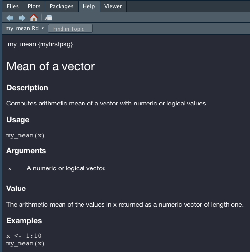
```

After adding the documentation its best to re-run the tests and R Cmd check to ensure nothing unexpected happened while adding the documentation. Later chapters will go into the details of roxygen documentation along with other documentation we should be updating along the way (i.e. NEWS.md).

## Step 8: Version control

We now have the new functionality and documentation in place. Now we need to commit our changes, push them to Github and do a pull request to merge into the development branch of the package. 

```{block, type="tip"}
Learn about writing clear and effective git messages [here](http://udacity.github.io/git-styleguide/).
```

```bash
git add -A
git commit -m "feat: add my_mean to compute arithmetic mean"
git push --set-upstream origin add_mean
```

Once the changes have been pushed to Github you will notice the updated branch changes were successfully pushed. Next, select the "Compare & pull request" button next to the new changes:

```{r new-branch-then-pr, echo=FALSE, fig.align='center'}
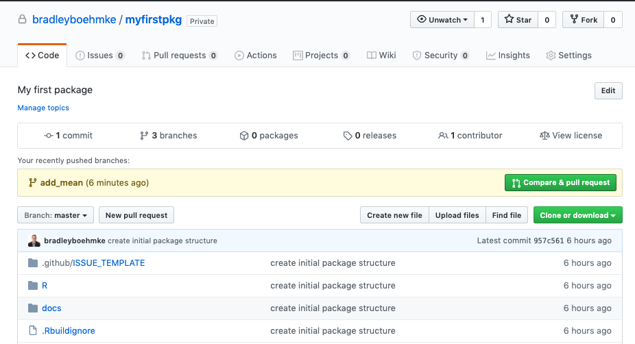
```

Be sure to choose the "base: develop" option for the pull request. This will signal that we want to merge our changes in the the feature branch with the develop branch:

```{r pr-into-develop, echo=FALSE, fig.align='center'}
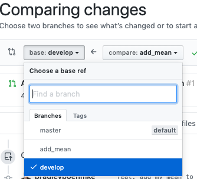
```

Next we add a good summary of the pull request that signals what we added/changed and that we ran tests and checks successfully.  After you add the message, go ahead and tag a friend or colleague to review your pull request. With more formalized projects we typically require that 1-2 folks have reviewed code changes in pull requests.

```{r pr-msg, echo=FALSE, fig.align='center'}
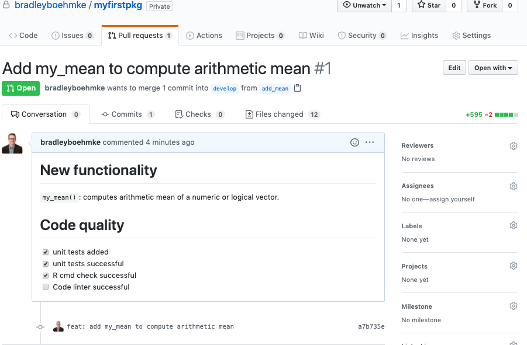
```

Once all reviewers have successfully signed off on the pull request go ahead and merge it into develop.

```{block, type="tip"}
If pull requests are new to you, read more about them here:

- [Github help docs](https://help.github.com/en/github/collaborating-with-issues-and-pull-requests)
- [The (written) unwritten guide to pull requests](https://www.atlassian.com/blog/git/written-unwritten-guide-pull-requests)
- [Best practices for pull requests](https://github.community/t/best-practices-for-pull-requests/10195)
```


# `r fontawesome::fa("python")` workflow example {#workflow-py}
Now we'll work through a simple example to illustrate how to perform the basic workflow steps for n `r fontawesome::fa("python")` package. As in the previous section, we'll create a package that has a single function...calculating the mean of a vector.

## Step 1: Check package name

Although we are not going to publish this package we should still check to make sure there are no other packages that have the same name. For this example, I'm going to use the name "__myfirstpypkg__". We can use `pip search` to check the availability of the name on PyPI.

```{block, type='warning'}
If you followed along in last sections R example then make sure you use a different name.
```

In this case, we see that there are no conflicting packages on PyPI!  So let's proceed.

```bash
pip search myfirstpypkg
```

## Step 2: Create package directory and structure

Now let's create the initial package structure. There are several ways to do this but similar to the `r fontawesome::fa("r-project")` example we'll use a pre-built template that helps automate the initial structure. Open up your terminal. If you didn't follow along in the last section then run the following to install [cookiecutter](https://cookiecutter.readthedocs.io/en/1.7.2/README.html):

```sh
pip install cookiecutter
```

Now go to the location that you want the package source code to live (i.e. a directory on your Desktop versus in a Packages subdirectory). In my case, I am going to keep this in a misk subdirectory:

```sh
cd ~/Desktop/Workspace/Projects/misk
```

Next, run the following command: 

```sh
cookiecutter https://github.com/misk-data-science/package-template
```

When you run this, you will be asked a series of questions such as your name, email, and package specific questions. For my package, I provided the following command responses:

```sh
first_name [ex: John]: Brad
last_name [ex: Smith]: Boehmke
email [first.last@example.com]: bradleyboehmke@gmail.com
github_username [bradleyboehmke]: bradleyboehmke
package_language [r or python]: python
package_name [awesome]: myfirstpypkg
package_short_description [short one-liner, ex: My first package]: My first package
version [0.1.0]: 
url [https://github.com/bradleyboehmke/myfirstpypkg]: 
Select open_source_license:
1 - MIT license
2 - BSD license
3 - ISC license
4 - Apache Software License 2.0
5 - GNU General Public License v3
6 - Not open source
Choose from 1, 2, 3, 4, 5, 6 [1]: 5
```

```{block, type='warning'}
The values in the brackets are the default values if you do not supply any input. For example, note how I did not enter any values for the version number or the URL. This is because 0.1.0 is nearly always a good first version number to start with. The Github URL is automatically generated so unless you choose to use a different remote the default should be a good choice.
```

You should now have a directory with your package name in your current directory. If you use the shell command `ls` you should see __myfirstpypkg__ listed. Here is what my directory look likes:

```bash
ls
ds-packages		misk-dl			misk-homl		myfirstpkg		myfirstpypkg		package-template
```

## Step 3: Version control

The first thing we want to do is create a remote where we'll push our source code to (i.e. Github). In our case, we'll use Github. First, [create a new repository](https://help.github.com/en/articles/creating-a-new-repository) on GitHub. 

```{r create-repo-python, echo=FALSE, fig.align='center'}

```

To avoid errors, do not initialize the new repository with README, license, or gitignore files since our local directory already contains these files.

```{r create-myfirstpypkg-repo, echo=FALSE, fig.align='center'}
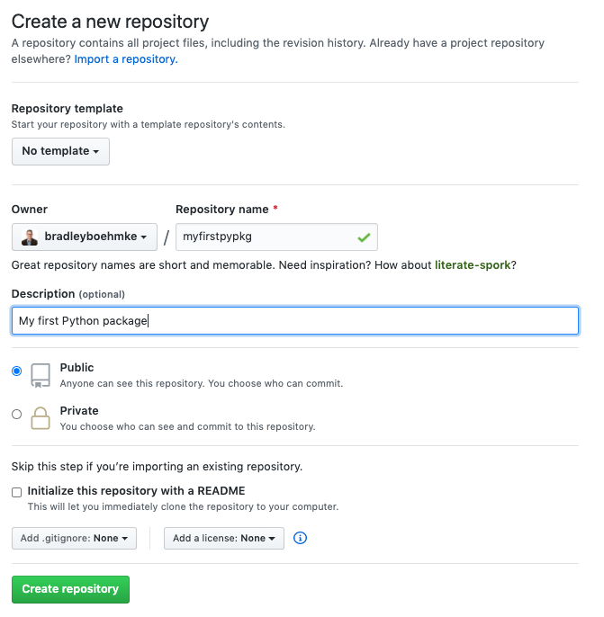
```

Now go back to your terminal and `cd` into the source code directory.

```bash
cd myfirstpypkg
```

Next, we initialize the local package directory as a git repo and add the remote URL. This allows changes to be tracked and when we push and pull our changes it will push and pull from the URL location.  We can always verify that our remote was added with `git remote -v`:

```bash
git init .
git remote add origin https://github.com/bradleyboehmke/myfirstpypkg

# verify remotes were added
git remote -v
origin	https://github.com/bradleyboehmke/myfirstpypkg (fetch)
origin	https://github.com/bradleyboehmke/myfirstpypkg (push)
```

Now let's create our first commit so that we have a baseline (although empty) package.

```bash
git add -A
git commit -m "create initial package structure"
git push --set-upstream origin master
```

Now if you look at your Github repo you will see the master branch has your current directory contents.

```{r initial-master-python, echo=FALSE, fig.align='center'}
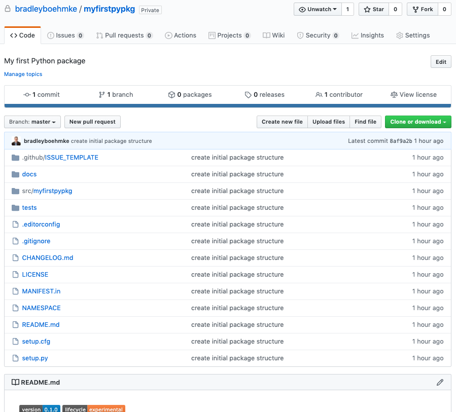
```

Recall in section \@ref(version-control) that we prefer to do development work with a __support » develop » master__ branch framework. This has us doing work in a support branch and not the master or develop branch. Right now we only have a master branch established so let's create a develop branch with `git checkout -b develop` and push the contents of the develop branch (which are the same as the master) to Github.

```bash
git checkout -b develop
git push --set-upstream origin develop
```

Now if you look at Github you'll notice that we have two branches in our repo:

```{r two-branches-python, echo=FALSE, fig.align='center'}

```

Whew `r emo::ji("whew")`! We finally have our version control set up. That was a bit of work but you only need to do that once at package creation time.

## Step 4: Setup virtual environment

Before we add any new functionality to our package, let's create a virtual environment so we can keep all our package dependencies isolated to the location we are working in. Go ahead and open up the Python project in your favorite editor. I will be using VS Code and I can open up the project with:

```{block, type='note'}
This assumes that you have already set the project directory as the working directory.
```


```bash
code .
```

This will open the project, which is where we'll do the majority of our work from here on out. We'll use the __venv__ package to create a virtual environment. Run the following in your terminal to create and activate the virtual environment:

```bash
python -m venv venv
source venv/bin/activate
```

This will add a `venv/` directory to your repo. If you look inside the `venv/` directory you will see a `lib/` directory that contains a couple of basic packages.  

Now let's install all the initial packages that we will need. The `setup.py` file contains package dependencies. By running the following, we will install all these dependencies into our environment. The `-e` installs our empty package in an __e__ditable fashion, this means as we make updates to the package we won't need to reinstall along the way. The `".[dev]"` installs all development required dependencies. We'll cover this in chapter \@ref(metadata).

```bash
pip install -e ".[dev]"
```

```{block, type="tip"}
Whenever you are done working in your virtual environment you can run `deactivate` to exit out of your virtual environment.
```

## Step 5: Add new functionality

Now that our virtual environment is set up, let's add some functionality to our package.  The first thing we'll add is a function that computes the mean of a vector. Recall that when we add new functionality we:

1. create a new branch to do the work in,
2. create a test that initially fails,
3. write the code to make the test pass.

So first, we'll create a new branch, which we can just call `add_mean`:

```bash
git checkout -b add_mean
```

Now let's create two new files:

- `touch src/myfirstpypkg/mean.py`: creates a new `mean.py` file within the source code directory. This is where our function will be written.
- `touch tests/test_mean.py`: creates a new `test_mean.py` file within the `tests/` directory. This is where the test to ensure our function is working correctly will go.

```bash
touch src/myfirstpypkg/mean.py
touch tests/test_mean.py
```

```{block, type="note"}
Later chapters will discuss ways to organize your source code within the `src/` directory and your associated tests. For now, we'll just create a new script for both.
```

Now open up the `src/myfirstpypkg/mean.py` file and insert a shell function. `pass` is a null operation -- when it's executed, nothing happens and consequently the function will return `None`. This allows us to create and run a failing first test.

```{python, eval=FALSE}
def my_mean(x):
    pass
```

Now open the `tests/test_mean.py` file and let's create our first test. We can always add more tests later but for the first test we just want to check for the most basic functionality. Consequently, this test is simply testing that the mean of values 0, 1, 2, 3, 4, 5, 6, 7, 8, 9, 10 is 5.

```{python, eval=FALSE}
from myfirstpypkg.mean import my_mean

def test_my_mean():
    x = range(0, 11)
    assert my_mean(x) == 5
```

Now we can run our tests by executing `pytest` at the command line:

```bash
pytest
===================================== test session starts ======================================
platform darwin -- Python 3.7.3, pytest-5.4.2, py-1.8.1, pluggy-0.13.1
rootdir: /Users/b294776/Desktop/Workspace/Projects/misk/myfirstpypkg, inifile: setup.cfg, testpaths: tests/
collected 1 item                                                                               

tests/test_mean.py F                                                                     [100%]

=========================================== FAILURES ===========================================
_________________________________________ test_my_mean _________________________________________

    def test_my_mean():
        x = range(0, 11)
>       assert my_mean(x) == 5
E       assert None == 5
E        +  where None = my_mean(range(0, 11))

tests/test_mean.py:5: AssertionError
=================================== short test summary info ====================================
FAILED tests/test_mean.py::test_my_mean - assert None == 5
====================================== 1 failed in 0.09s =======================================
```
As you see above, our test is failing. So let's start adding code to make this test pass. We know that the mean is computed as $m = \frac{\text{sum of terms}}{\text{number of terms}}$. Let's update our function to account for that:

```{python, eval=FALSE}
def my_mean(x):
    total = sum(x)
    units = len(x)
    return total / units
```

Now running our test again we get success!

```bash
pytest
========================================= test session starts =========================================
platform darwin -- Python 3.7.3, pytest-5.4.2, py-1.8.1, pluggy-0.13.1
rootdir: /Users/b294776/Desktop/Workspace/Projects/misk/myfirstpypkg, inifile: setup.cfg, testpaths: tests/
collected 1 item                                                                                      

tests/test_mean.py .                                                                            [100%]

========================================== 1 passed in 0.01s ==========================================
```

We likely want to iterate like this to make our function more robust. For example, what happens if a user passes non-numeric values or a non-list data structure to our function?  Or what happens if our list contains `None`, `np.nan`, or or some other missing value representation values? For each scenario like this we want to create a test first, make sure it fails, and then add the new functionality to our code to make our tests pass.  We'll explore this process more in chapter \@ref(test).

We have empirical evidence that `my_mean()` works so now let's talk about documentation.

## Step 6: Document

We now have new working functionality in our package, the last thing we want to do is properly document our function. We do this with [docstrings](https://www.python.org/dev/peps/pep-0257/). We can add object-level documentation to our `my_mean()` function like this:

```{python, eval=FALSE}
def my_mean(x):
    """
    Mean of a vector

    Computes arithmetic mean of a vector with numeric or logical values.

    Parameters
    ----------
    x
        A numeric or logical list.

    Returns
    -------
    The arithmetic mean of the values in x returned as a numeric vector of length one.

    Examples
    --------
    >>> x = range(0, 11)
    ... my_mean(x)
    """
    total = sum(x)
    units = len(x)
    return total / units
```

After adding the documentation we can now get various help documentation on the function. For example, hovering over the function in my editor shows the following:

```{r help-docs-python, echo=FALSE, fig.align='center'}
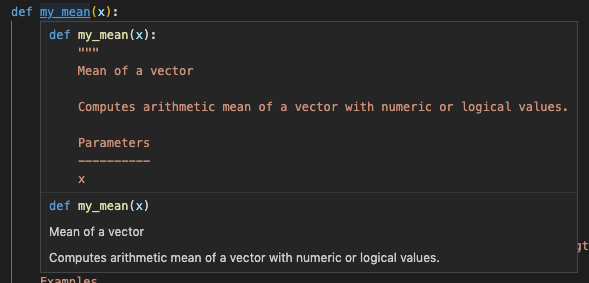
```

After adding the documentation its best to re-run the tests to ensure nothing unexpected happened while adding the documentation. Later chapters will go into the details of docstrings along with other documentation we should be updating along the way (i.e. module level docstrings, CHANGELOG.md).

## Step 7: Version control

We now have the new functionality and documentation in place. Now we need to commit our changes, push them to Github and do a pull request to merge into the development branch of the package. 

```{block, type="tip"}
Learn about writing clear and effective git messages [here](http://udacity.github.io/git-styleguide/).
```

```bash
git add -A
git commit -m "feat: add my_mean to compute arithmetic mean"
git push --set-upstream origin add_mean
```

Once the changes have been pushed to Github you will notice the updated branch changes were successfully pushed. Next, select the "Compare & pull request" button next to the new changes:

```{r new-branch-then-pr-python, echo=FALSE, fig.align='center'}
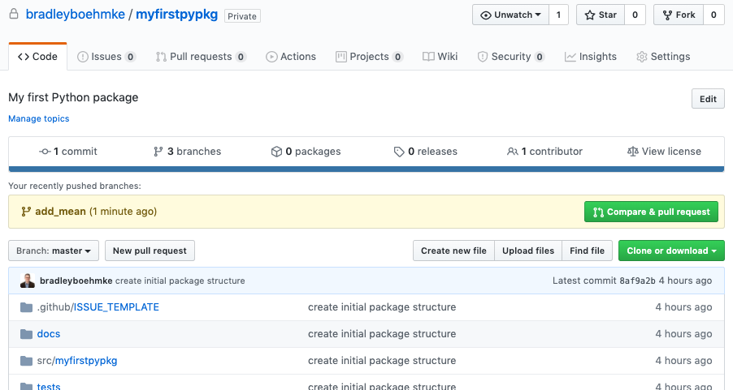
```

Be sure to choose the "base: develop" option for the pull request. This will signal that we want to merge our changes in the the feature branch with the develop branch:

```{r pr-into-develop-python, echo=FALSE, fig.align='center'}

```

Next we add a good summary of the pull request that signals what we added/changed and that we ran tests and checks successfully.  After you add the message, go ahead and tag a friend or colleague to review your pull request. With more formalized projects we typically require that 1-2 folks have reviewed code changes in pull requests.

```{r pr-msg-python, echo=FALSE, fig.align='center'}
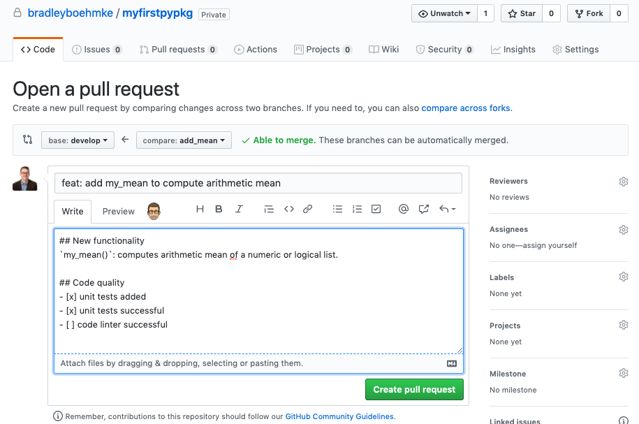
```

Once all reviewers have successfully signed off on the pull request go ahead and merge it into develop.

```{block, type="tip"}
If pull requests are new to you, read more about them here:

- [Github help docs](https://help.github.com/en/github/collaborating-with-issues-and-pull-requests)
- [The (written) unwritten guide to pull requests](https://www.atlassian.com/blog/git/written-unwritten-guide-pull-requests)
- [Best practices for pull requests](https://github.community/t/best-practices-for-pull-requests/10195)
```

# Exercises

Pick at least one exercise for R and one for Python to complete. Write up a summary of the findings and share with a colleague:

* R blended learning exercises
   1. Read [Navigating the R Package Universe](https://journal.r-project.org/archive/2018/RJ-2018-058/RJ-2018-058.pdf).
   2. Watch David Robinson's screencast on [creating an R data package](https://www.youtube.com/watch?edufilter=NULL&v=F4oUJp76KUY).
   
* Python blended learning exercises
   1. Read [Hitchhiker's Guide to Python: Packaging Your Code]().
   2. Read [Python's New Package Landscape](http://andrewsforge.com/article/python-new-package-landscape/).
