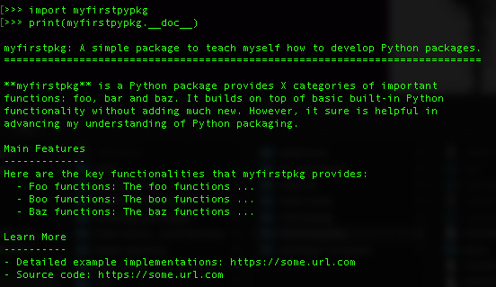

<br>

Documentation is one of the most important aspects of a good package. Without it, users won’t know how to use your package. Documentation is also useful for collaborating developers, and the future-you (so you remember what your functions were supposed to do), looking to extend your package.

## Levels of documentation

There are multiple forms of documentation. In this module, you’ll learn about object documentation, as accessed by `?` or `help()`. Object documentation is a string literal specified in source code that is used, like a comment, to document a specific segment of code. The three main types of object documentation we'll illustrate in this module are:

- __Package-level documentation__: Top level description for what your package does and can point users to additional resources if necessary.
- __Module-level documentation__: More common in `r fontawesome::fa("python")` than `r fontawesome::fa("r-project")` and helps to describe the purpose and contents of an individual module within a package.
- __Function-level documentation__: The function documentation that you have already been exposed to in earlier modules.

```{block, type='tip'}
We are advocates for documenting as much as possible. It may slow you down initially but over the longterm it will speed up the development and maintenance process of a package.
```


## `r fontawesome::fa("r-project")` object documentation example

R object documentation is generated from the `.Rd` files in the `man/` directory. If you look at one of the current `.Rd` files in your package's `man/` directory you'll see LaTeX-like syntax. However, properly writing the `.Rd` files can be burdensome so we use [roxygen2](https://roxygen2.r-lib.org/) to automate this process. Plus, it allows us to include documentation directly with our functionality. The sections that follow will illustrate the most common uses of roxygen2.

### Package-level documentation

You can use roxygen to provide a help page for your package as a whole. This is accessed with `package?pkg_name` (when the package is not loaded) or with `?pkg_name` when it is loaded, and can be used to describe the most important components of your package. 

There’s no object that corresponds to a package, so you need to document `NULL`, and then manually label it with `@docType package` and `@name <package-name>`. This is also an excellent place to use the `@section` tag to divide up the page into useful categories. For example, you can include the following package documentation in a file called `<package-name>.R`:

```{block, type='tip'}
The `\@section` tag allows you to create as many arbitrary sections as necessary.
```


```{r, eval=FALSE}
#' myfirstpkg: A simple package to teach myself how to develop R packages..
#'
#' The myfirstpkg: package provides X categories of important functions:
#' foo, bar and baz.
#'
#' @section Foo functions:
#' The foo functions ...
#'
#' @section Boo functions:
#' The bar functions ...
#'
#' @section Baz functions:
#' The baz functions ...
#'
#' @section Learn more:
#' \itemize{
#'   \item \href{https://some.url.com}{Vignettes} Detailed example implementations.
#'   \item \href{https://some.url.com}{Source code} Dig into the source code.
#' }
#'
#' @section Author(s):
#' \strong{Maintainer}: Brad Boehmke \email{bradleyboehmke@gmail.com}
#'
#' Authors:
#' \itemize{
#'   \item John Doe
#'   \item Jane Doe
#' }
#'
#' Other contributors:
#' \itemize{
#'   \item Sally Mae
#'   \item Paul Smith
#' }
#'
#' @docType package
#' @name myfirstpkg
NULL
#> NULL
```

Now if do the following:

1. `devtools::document()`: to add a `.Rd` file for the package,
2. `devtools::load_all()`: to load the package contents,
3. `?myfirstpkg`: to access the package help documentation

You'll see the following in the __Help__ window:

```{r, echo=FALSE, fig.align='center', out.width="100%", out.height="100%"}
knitr::include_graphics("../figures/r-pkg-docs.png")
```

### Module-level documentation

Documentating individual `.R` scripts (i.e. modules) is not common among R developers and, unlike Python, there is no formal approach to do this. However, as your package expands it is not uncommon for individual source code scripts to become long and contain many functions and/or classes. When this happens, it can be helpful to document the scripts to explain the purpose of the script (remember, you should be grouping like items within a script) and the functions/class it contains.

To do this in `r fontawesome::fa("r-project")` you would just use comment blocks. For example, you could add the following to the top of the `summary-stats.R` script to provide a synopsis of the intent and contents of the scripts. 

```{block, type="tip"}
Use Cmd/Ctrl + Shift + R to add the `# Some lable ----------` comment blocks.
```

```{r, eval=FALSE}
# Description ---------------------------------------------------------------------

# Primary interface for summary statistics functionality
#
# A longer description can go here if greater details needs to be
# provided that span multiple lines.
#
# Available classes:
# - NA
#
# Available functions:
# - z_score: Computes z-score of a numeric/logical vector.
# - my_sd: Computes standard deviation of a numeric/logical vector.
# - my_mean: Computes arithmentic mean of a numeric/logical vector.


# Source code ---------------------------------------------------------------------
...
```

### Function-level documentation

Functions are the most commonly, and most important, documented object. As well as the introduction block, most functions have at least three tags: 

* __`@param`__: Describes the function’s inputs or parameters. The description should provide a succinct summary of the type of the parameter (e.g., string, numeric vector) and, if not obvious from the name, what the parameter does. All parameters must be documented otherwise you will receive warnings when running `devtools::check()`.

* __`@examples`__: Provides executable R code showing how to use the function in practice. This is a very important part of the documentation because many people look at the examples first. For the purpose of illustration, it’s often useful to include code that causes an error. Or sometimes you may have examples that have other dependencies (i.e. creating a Spark environment). Wrapping your example(s) with `\dontrun{}` allows you to include code in the example that is not run.

* __`@return`__: Describes the output from the function. This is not necessary but it is a good idea to always include it so it is clear to the consumer what to expect as output. This becomes even more important when your output type differs from your input type (i.e. input is a data frame but the output is a vector).

We have already seen all three of these in action with our current `my_mean()` documentation:

```{r, eval=FALSE}
#' Mean of a vector
#'
#' @description
#' Computes arithmetic mean of a vector with numeric or logical values.
#'
#' @param x A numeric or logical vector.
#' @param na.rm Boolean specifying whether or not to remove NA and NaN values..
#' @param inf.rm Boolean specifying whether or not to remove Inf values.
#'
#' @return
#' The arithmetic mean of the values in x returned as a numeric vector of length one.
#'
#' @examples
#' x <- 1:10
#' my_mean(x)
#'
#' @export
my_mean <- function(x, na.rm = TRUE, inf.rm = TRUE) {
  validate_numeric_vector(x)
  x <- validate_special_values(x, na.rm, inf.rm)
  total <- sum(x)
  units <- length(x)
  return(total / units)
}
```

### Additional syntax

There are many additional syntax improvements you can make to your documentation. For example, you can 

- make text italicized, bold or formatted as code,
- cross reference other documentation within the package,
- hyperlink to websites,
- include unordered and ordered lists,
- include math equations,
- and much more.

```{block, type="tip"}
See [here](https://r-pkgs.org/man.html#text-formatting) for a quick reference guide of different documentation syntax formatting.
```


## `r fontawesome::fa("python")` object documentation example

Python object documentation is generated from [docstrings](https://www.python.org/dev/peps/pep-0257/). Docstrings should always use `"""triple double quotes"""` and are usually multiline.

```{block, type="tip"}
A great article on approaching Python project documentation - https://realpython.com/documenting-python-code/
```


### Package-level documentation

The docstring for a package is contained in the `__init__.py` script and typically explains the main features of the package but can also list the modules and subpackages exported by the package. We could add similar package-level documentation as we did in the R example section by adding the following to `myfirstpypkg/src/myfirstpypkg/__init__.py`:

```{python, eval=FALSE}
__doc__ = """
myfirstpkg: A simple package to teach myself how to develop Python packages.
============================================================================

**myfirstpkg** is a Python package provides X categories of important
functions: foo, bar and baz. It builds on top of basic built-in Python
functionality without adding much new. However, it sure is helpful in
advancing my understanding of Python packaging.

Main Features
-------------
Here are the key functionalities that myfirstpkg provides:
  - Foo functions: The foo functions ...
  - Boo functions: The boo functions ...
  - Baz functions: The baz functions ...

Learn More
----------
- Detailed example implementations: https://some.url.com
- Source code: https://some.url.com
"""
```

The above adds a `__doc__` attribute to our package containing the docstring. So if you go to the terminal and

1. `import myfirstpypkg`
2. `print(myfirstpypkg.__doc__)`

You will see the documentation print out:

```{r, echo=FALSE, fig.align='center', out.width="100%", out.height="100%"}

```

### Module-level documentation

The docstring for individual `.py` scripts/modules can also be done with docstrings at the very top of the module. These generally explain the purpose of the module (remember, you should be grouping like items within a module) and list the classes, exceptions and functions (and any other objects) that are contained in the module, with a one-line summary of each. (These summaries generally give less detail than the summary line in the object's docstring.) 

For example, you could add the following to the top of the `summary_stats.py` script to provide a synopsis of the intent and contents of the scripts. 

```{python, eval=FALSE}
"""Primary interface for summary statistics functionality.

A longer description can go here if greater details needs to be provided
that span multiple lines.

Available classes:
- NA

Available functions:
- z_score: Computes z-score of a numeric/boolean sequence.
- my_sd: Computes standard deviation of a numeric/boolean sequence.
- my_mean: Computes arithmentic mean of a numeric/boolean sequence.
"""
```

Now, you or a developer can easily understand the contents contained in that module. And most editors will provide you the docstring information when hovering/highlighting references to the module. For example, in VS Code, when I place my cursor over the reference to the `summary_stats` in the `__init__.py` script I see the following:

```{r, echo=FALSE, fig.align='center', out.width="100%", out.height="100%"}
knitr::include_graphics("../figures/py-module-docs.png")
```


### Function-level documentation

Functions are the most commonly, and most important, documented object. As well as the introduction block, most functions have at least three sections: 

* __`Parameters`__: Describes the function’s inputs or parameters. The description should provide a succinct summary of the type of the parameter (e.g., bool, int, list, tuple) and, if not obvious from the name, what the parameter does.

* __`Returns`__: Describes the output from the function. This is not necessary but it is a good idea to always include it so it is clear to the consumer what to expect as output. This becomes even more important when your output type differs from your input type (i.e. input is a dictionary but the output is a list).

* __`Examples`__: Provides executable Python code showing how to use the function in practice. This is a very important part of the documentation because many people look at the examples first. 

It's not uncommon to see other sections such as __`Attributes`__ and __`Methods`__ for class docstrings and __`Raises`__ to describe when functions or methods will raise an exception.

We have already seen all three of these in action with our current `my_mean()` documentation:

```{python, eval=FALSE}
def my_mean(x, rm_none = True):
    """
    Mean of a sequence

    Computes arithmetic mean of a sequence with numeric or logical values.

    Parameters
    ----------
    x
        A numeric or logical sequence.
    rm_none
         Boolean specifying whether or not to remove `None` values.

    Returns
    -------
    The arithmetic mean of the values in x returned as a numeric value of length one.

    Examples
    --------
    >>> x = range(0, 11)
    ... my_mean(x)
    """
    _validate_numeric_sequence(x)
    x = _validate_none_values(x, rm_none)
    total = sum(x)
    units = len(x)
    return total / units
```

### Type hints {#typehints}

There is another unique approach to documentating Python classes, functions, and methods called type hints. Type hints allow you to annotate required specifications of object types within the function call. For example, the following states that:

- the parameter `name` should be of type string
- the output of our function (as indicated with `-> str`) should also be a string.

```{python, eval=FALSE}
def greeting(name: str) -> str:
    return 'Hello ' + name
```

```{block, type='tip'}
Type hints are a more advanced topic but as you get more comfortable writing Python code, and especially when writing code others will use, type hints are definitely something you will want to learn and incorporate. You can learn more about type hints at:

- https://www.python.org/dev/peps/pep-0484/
- https://docs.python.org/3/library/typing.html
- https://realpython.com/lessons/type-hinting/
```

## Exercises

Focusing on the R and Python packages you created in the portfolio builder:

1. Fork one of your classmates packages, create a new branch, add package-level documentation and create a pull request.
2. Fork another classmates packages, create a new branch, add module-level documentation and create a pull request.
3. Fork another classmates packages, create a new branch, add function-level documentation and create a pull request.
4. __Optional__: Review the referenced documentation for [type-hints](#typehints) add type hints to your existing code. Be sure to run [mypy](https://mypy.readthedocs.io/en/stable/) on your package to ensure your type hints are implemented correctly.

```{block, type='note'}
As a reviewer of the above pull requests, be sure to thoroughly review the contributors changes. It is ok to ask for edits or corrections on a pull request. And as a submitter of the above pull requests, if the maintainer requests edits or even rejects your pull request, don't take this personally. Listen to their reasons why, learn from them and move on.
```
