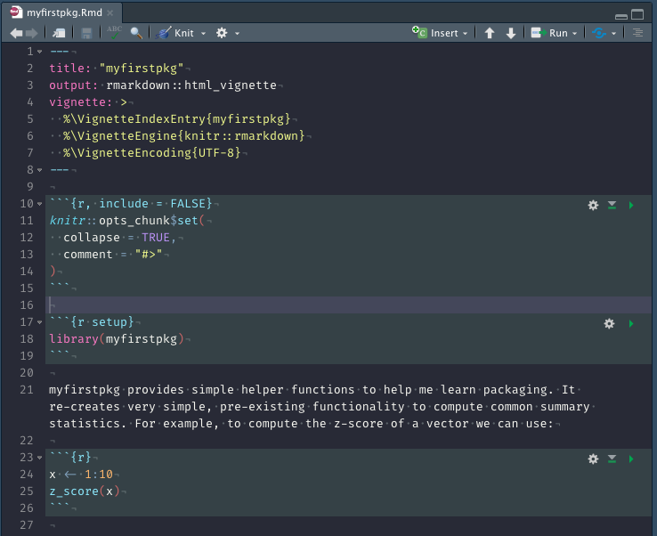
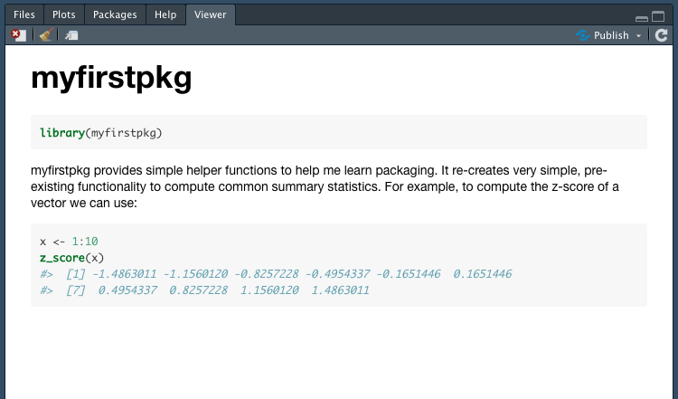
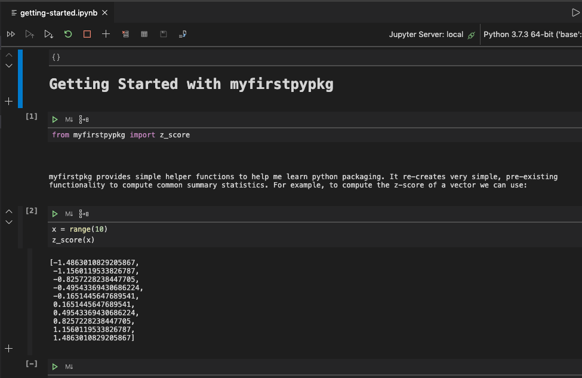
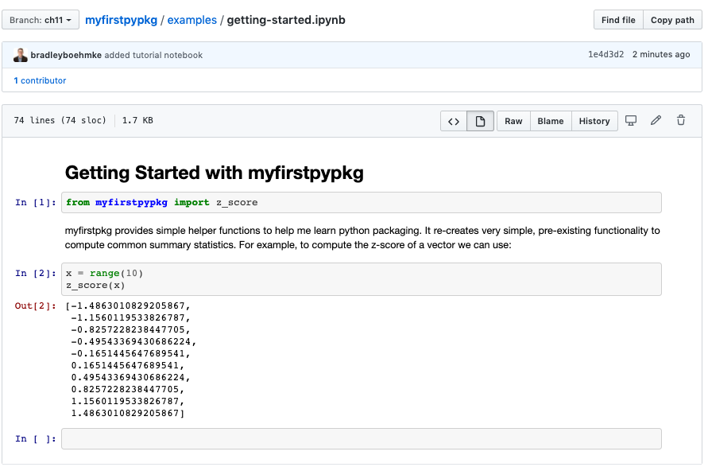

<br>

The [README](#readme) is designed to get a new user up and running with your package as quickly as possible. However, you should not go into too much depth in the README because it can be overwhelming. As your package grows and becomes more complex, you will likely want to create tutorials that are designed to give the user the next step of instruction with greater detailed, longer-form documentation.

## Vignettes & notebook tutorials

Although not required, it is very common to find long-form documentation in both `r fontawesome::fa("python")` and `r fontawesome::fa("r-project")` packages. Within `r fontawesome::fa("r-project")` these are commonly called _"vignettes"_ while in Python it is common to store these tutorials in Jupyter notebooks.

When writing tutorials, you’re teaching someone how to use your package. You need to put yourself in the readers’ shoes, and adopt a "beginner’s mind". This can be difficult because it’s hard to forget all of the knowledge that you’ve already internalized. For this reason, we find it beneficial to have someone that has never used our package before to read through the tutorial and provide feedback. 

Considering our prototype packages are very small, the following sections will merely demonstrate how to set up your basic long-form documentation. However, to give you an idea of how to approach this form of documentation for larger packages check out these examples:

* `r fontawesome::fa("r-project")`
   - https://pkgdown.r-lib.org/articles/pkgdown.html
   - https://dplyr.tidyverse.org/articles/dplyr.html
   - https://parsnip.tidymodels.org/articles/parsnip_Intro.html
* `r fontawesome::fa("python")`
   - https://numpy.org/devdocs/user/quickstart.html
   - https://github.com/has2k1/plotnine-examples/tree/master/plotnine_examples
   - https://github.com/scikit-learn/scikit-learn/tree/master/examples
   
## `r fontawesome::fa("r-project")` tutorial docs example

In an `r fontawesome::fa("r-project")` package we use vignettes as our long-form documentation. We can create the vignette structure easily with:

```{r, eval=FALSE}
usethis::use_vignette("myfirstpkg")
```

```{block, type='note'}
You may get an error message stating you need to add 'rmarkdown' or possibly another package. Since you should be operating in your virtual environment you will need to install this package (`install.packages('rmardown')`) and then `renv::snapshot()`.
```

This automates three steps for us:

1. Create a `vignettes/` directory.
2. Add the necessary dependencies to the `DESCRIPTION` file.
3. Creates a draft vignette, `vignettes/myfirstpkg.Rmd`.

Once you have the vignette structure then the typical workflow is...

1. Update the vignette
2. Knit the vignette and preview the output (Ctrl/Cmd + Shift + K)

When you open up the vignette that was created, you'll see YAML metadata at the top. You'll want to leave most of this as-is but you can change the `title` and corresponding `VignetteIndexEntry{myfirstpkg}` if you want to name your vignette something else.

```
---
title: "myfirstpkg"
output: rmarkdown::html_vignette
vignette: >
  %\VignetteIndexEntry{myfirstpkg}
  %\VignetteEngine{knitr::rmarkdown}
  %\VignetteEncoding{UTF-8}
---
```

The rest of the vignette uses basic http://rmarkdown.rstudio.com/ syntax. Let's add some simple information to our vignette so it looks like this:


```{r, echo=FALSE, fig.align='center', out.width="100%", out.height="100%"}

```

Now preview the output with Ctrl/Cmd + Shift + K. If you get an error stating myfirstpkg is not available then run `devtools::install()` first to install your package in the virtual environment and then you should be able to preview the output which will look like:

```{r, echo=FALSE, fig.align='center', out.width="100%", out.height="100%"}

```

Now when a user installs your package they can run `vignette(package = "myfirstpkg")` and see your vignette. This will also help us build a nice website as we'll see in the next chapter. 

## `r fontawesome::fa("python")` tutorial docs example

There are a couple ways to do long-form documentation for `r fontawesome::fa("python")` packages but the simplest to get started is by creating [Jupyter notebooks](https://jupyter.org/) and store them in an "examples" or "tutorials" directory. Although these will not be deployed with the package as is the case with `r fontawesome::fa("r-project")` packages, they will be easily viewable on Github since Github renders notebooks as HTML.

Let's go ahead and create an `examples` directory with a "Getting started" notebook:

```bash
mkdir examples
touch examples/getting-started.ipynb
```

Now you can open up the notebook and create your tutorial. We'll add a similar dummy tutorial example as we did in the `r fontawesome::fa("r-project")` example.

```{r, echo=FALSE, fig.align='center', out.width="100%", out.height="100%"}

```

Now when you push this to Github it'll render as the following:

```{r, echo=FALSE, fig.align='center', out.width="100%", out.height="100%"}

```

## Exercises

1. Review these packages long-form documentation and identify three strengths that these all have in common and then identify particular weaknesses in one or more of them.
   * `r fontawesome::fa("r-project")`
      - https://pkgdown.r-lib.org/articles/pkgdown.html
      - https://dplyr.tidyverse.org/articles/dplyr.html
      - https://parsnip.tidymodels.org/articles/parsnip_Intro.html
   * `r fontawesome::fa("python")`
      - https://numpy.org/devdocs/user/quickstart.html
      - https://github.com/has2k1/plotnine-examples/tree/master/plotnine_examples
      - https://github.com/scikit-learn/scikit-learn/tree/master/examples

2. Add an introductory vignette to help newcomers use your R package.

3. Add an introductory vignette to help newcomers use your R package.
