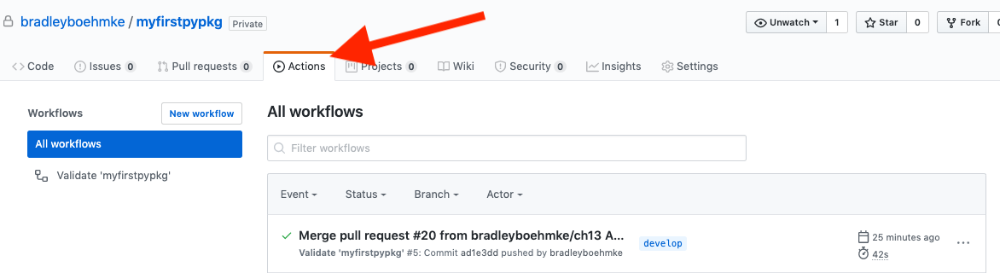
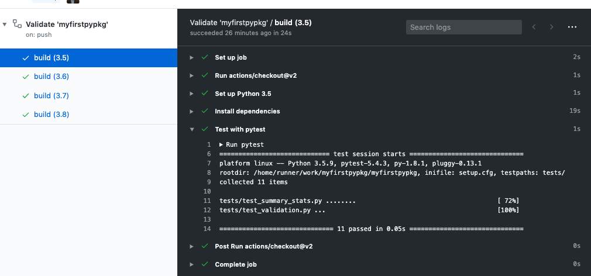
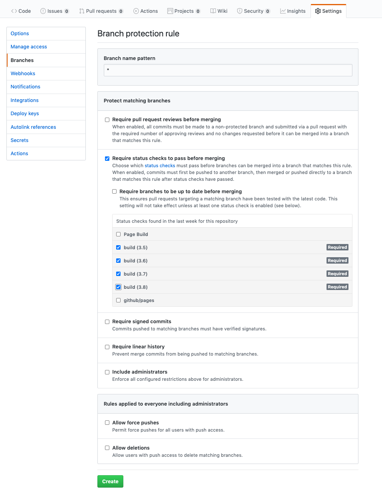
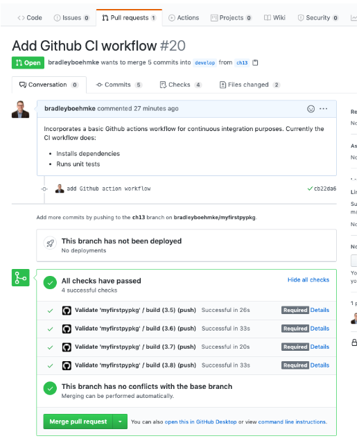

<br>

## CI/CD

**Continuous integration** is the idea of continuously testing our Python package as we make changes to our source code and **continuous delivery/deployment** is the idea that we continuously and automatically deploy our package to a production environment. Together we refer to this process as **CI/CD**. 

Thus far, every time we made updates to our code we relied on ourselves to manually run any tests and checks to ensure our code is working. This may be fine for very small projects such as our example package where we are the only contributors. However, as our project gets larger and we have more contributors, it becomes important that we automate this process to ensure any changes made to our code base are done so with our quality expectations met. Automating this process will guarantee that all changes to our code have been tested. Moreso, we can set it up so that it is obvious if a commit or pull request is passing or failing.

There are many tools that can do this. Some common ones include:

- [Travis-CI](https://travis-ci.org/)
- [Azure Pipelines](https://azure.microsoft.com/en-us/services/devops/pipelines/)
- [GitHub Actions](https://github.com/features/actions)

```{block, type='note'}
All these services not only will automate the process of testing your package, but they can also automate the process of deploying your package to a production environment (or CRAN and PyPI). For this module we are only going to discuss the automation of testing, checking and building your package.
```

Although the setup for each of these services do differ, they all have a very similar approach - they use `.yaml` configuration files to drive the process. For our example, we are going to use [GitHub Actions](https://github.com/features/actions).

To create a new Github action we need to make a new directory and file within the `.github/` directory that currently exists at the root of your directory. First, make sure that your current directory is at the root of your package. Next, make a new directory called `workflows/` and within that new directory we'll create a `.yml` config file called `package-ci.yml`.

```bash
mkdir .github/workflows
touch .github/workflows/package-ci.yml
```

All our logic to direct our automated CI process will be contained in this `package-ci.yml` file but the contents will differ depending on the language of your package.

## `r fontawesome::fa("r-project")` CI example

The following provides a simple Github CI template to copy into your `package-ci.yml` file within your R package.

```{block, type='tip'}
This a very simple template that simply automates the workflow procedures we've been discussing thus far. However, you can easily extend this to automatically run linting procedures, build the package, and save the artifact. Learn how to extend the below template [here](https://ropenscilabs.github.io/actions_sandbox/) and [here](https://github.com/r-lib/actions/tree/master/examples).
```

```yml
name: Validate 'myfirstpkg'

on: [push]

jobs:
  build:

    runs-on: ubuntu-latest
    steps:
    - uses: actions/checkout@v2
    - uses: r-lib/actions/setup-r@master
    - name: Install dependencies
      run: |
        install.packages(c("remotes", "rcmdcheck"))
        remotes::install_deps(dependencies = TRUE)
      shell: Rscript {0}
    - name: Check
      run: rcmdcheck::rcmdcheck(args = "--no-manual", error_on = "error")
      shell: Rscript {0}

```

So what's going on with this script? 

- `name`: Provides a name for this Github workflow action. You can actually have more than one workflow `.yml` file that can drive multiple processes.
- `on`: Specifies when to run the Github action. Simply stating `push` means this action will run every time you push a new commit to Github. You could change this to something like the following which states to run the action only when pushing or performing a pull request to the master branch.
   
   ```yml
   on:
     push:
       branches: [ master ]
     pull_request:
       branches: [ master ]
    ```
- `runs-on`: OS platforms to run on. You can run on Ubuntu, Windows or Mac OS.
- `uses: actions/checkout@v2`: This is a [built-in Github step](https://github.com/actions/checkout) that checks out your repository to allow you to run your code on a virtual machine.
- `uses: r-lib/actions/setup-r@master`: This is a Github action step built and maintained by the [R community](https://github.com/r-lib/actions) that automates the process of creating an R environment in which to run your code.

The rest of the code should look familiar as it is the normal procedures we walked through in section \@ref(workflow-r) to install our dependency packages and run R Cmd check.

```{block, type='note'}
Note that when you run R Cmd check you are not only checking that the package meets all requirements but it also runs the unit tests and will fail if any of the tests fail.
```


## `r fontawesome::fa("python")` CI example

The following provides a simple Github CI template to copy into your `package-ci.yml` file within your Python package.

```{block, type='tip'}
This a very simple template that simply automates the workflow procedures we've been discussing thus far. However, you can easily extend this to automatically run linting procedures (i.e. flake8, mypy), build the package, and save the artifact. Learn how to extend the below template [here](https://help.github.com/en/actions/language-and-framework-guides/using-python-with-github-actions).
```


```yml
name: Validate 'myfirstpypkg'

on: [push]

jobs:
  build:

    runs-on: ubuntu-latest
    strategy:
      matrix:
        python-version: [3.5, 3.6, 3.7, 3.8]

    steps:
    - uses: actions/checkout@v2
    - name: Set up Python ${{ matrix.python-version }}
      uses: actions/setup-python@v2
      with:
        python-version: ${{ matrix.python-version }}
    - name: Install dependencies
      run: |
        python -m pip install --upgrade pip
        pip install -e ".[dev]"
    - name: Test with pytest
      run: |
        pytest
```

So what's going on with this script? 

- `name`: Provides a name for this Github workflow action. You can actually have more than one workflow `.yml` file that can drive multiple processes.
- `on`: Specifies when to run the Github action. Simply stating `push` means this action will run every time you push a new commit to Github. You could change this to something like the following which states to run the action only when pushing or performing a pull request to the master branch.
   
   ```yml
   on:
     push:
       branches: [ master ]
     pull_request:
       branches: [ master ]
    ```
    
- `runs-on`: OS platforms to run on. You can run on Ubuntu, Windows or Mac OS.
- `strategy / matrix`: You can run on an individual Python version or, as in this case, we want to run and test our code against Python versions 3.5-3.8.
- `uses: actions/checkout@v2`: This is a [built-in Github step](https://github.com/actions/checkout) that checks out your repository to allow you to run your code on a virtual machine.
- `uses: actions/setup-python@v2`: This is a [built-in Github step](https://github.com/actions/setup-python) that automates the process of creating a Python environment in which to run your code.

The rest of the code should look familiar as it is the normal `pip install` and `pytest` procedures we walked through in section \@ref(workflow-py).

## Leveraging the Results

Once you have added the requisite `package-ci.yml` file you can `git add, commit, push` to your remote repository. Once you have pushed your commit to Github, go to your Github repository and click on the __Actions__ tab:

```{r, echo=FALSE, fig.align='center', out.width="100%", out.height="100%"}

```

Within the Actions tab you will see the results of your automated CI action. If you followed the same procedure as above where we tested against multiple versions of R and/or Python then you will see the build for each version. Below is a screen shot of my Python CI action and if you click on one of the version builds you will see the results for each step in our action. Clicking on any of these steps will show the same terminal output that we would see in our local editor. In this example we see that my test results all passed.

```{r, echo=FALSE, fig.align='center', out.width="100%", out.height="100%"}

```

A benefit of using automated CI procedures is that you can protect your code from changing if the CI process does not successfully pass. The easiest way to do this is to add __branch protection__ rules. Branch rules allow us to limit branch manipulation, as well as enforce required status checks before a branch is merged in a pull request or before commits on a local branch can be pushed to the protected remote branch.

In this example, we'll set up a branch protection that ensures our Github CI action passes successfully before a pull request can be merged. If somebody updates the code, creates a pull request but one of the unit tests fail, then the pull request will not be allowed to merge until the code is fixed and the tests pass. This helps to enforce good code quality for all contributions.

To create this rule, go to __Settings >> Branches__ and create a new branch rule:

1. Use `*` for the Branch name pattern. This means this rule will be applied to _all_ branches. Alternatively, you could always add a rule to just one or two branches (i.e. "master").
2. Select `Require status checks to pass before merging` and choose just the build status checks but not the "Page Build" or "github/pages".
3. Select "Create".


```{r, echo=FALSE, fig.align='center', out.width="100%", out.height="100%"}

```

Now if you create a pull request to incorporate new code changes you will see a section that states whether or not "All checks have passed". In the below example, since all my checks pass I can merge the pull request.

```{r, echo=FALSE, fig.align='center', out.width="80%", out.height="80%"}

```

## Exercises

TBD

<br>
[🏠](https://github.com/misk-data-science/misk-packages)
